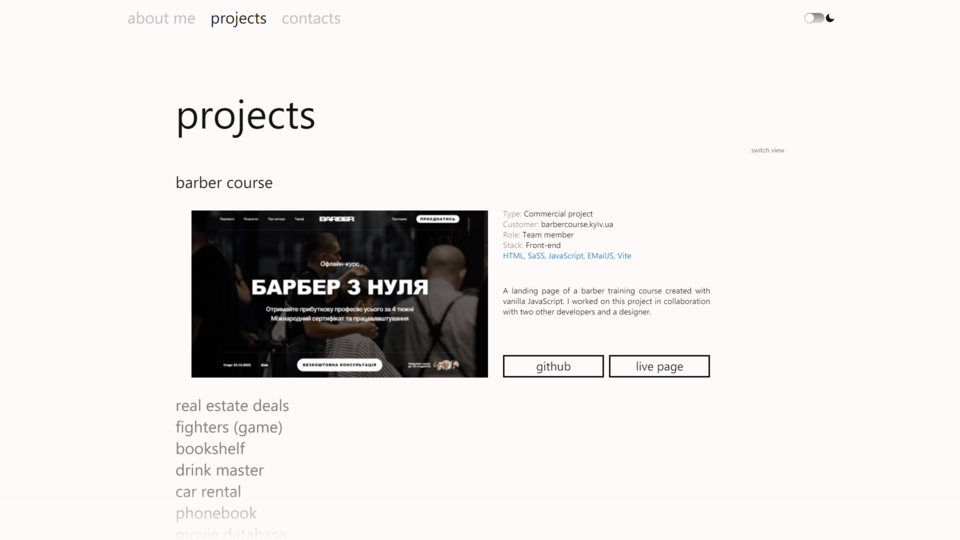
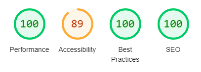

# About Me

To all to whom these presents shall come, greetings =)

This is my personal portfolio website created to showcase my projects and to give anyone interested a glimpse of my web-development skills.

<picture>
  <source media="(prefers-color-scheme: light)" srcset="./src/images/readme/screenshot_light_1x.webp 1x, ./src/images/readme/screenshot_light_2x.webp 2x">

   <source media="(prefers-color-scheme: dark)" srcset="./src/images/readme/screenshot_dark_1x.webp 1x, ./src/images/readme/screenshot_dark_2x.webp 2x">

  
</picture>

## Design

The design of this website was inspired by Windows Phone Metro interface which I have always found clean and attractive.

Project cards can be viewed either as a list (couldn't resist it since it is so characteristic of the Metro style) or a gallery (because I also wanted tiles).
Consider this an attempt to have the best of both worlds.

## Technologies

As this website was supposed to be a SPA/landing at the beginning, I chose to go with vanilla JavaScript instead of React.

My bundler of choice is Vite.

I have used EmailJS library for the contact form.

## Features

Here are some of the features of this website:

### Keyboard-accessible and screen-reader-friendly

- all controls are focusable and keyboard-accessible
- all images have `alt`s
- interactive elements without text have proper `aria-label`s
- project cards in list mode have `aria-expanded` attributes

### Images

- images are served in webp format and have been optimized with Squoosh
- images have been de-retinized in four different sizes which are loaded using `srcset` and `sizes` attributes

### Color themes

- light and dark color themes that can be switched manually or pick browsers current color theme

## Page load and best practices

<picture>
  <source media="(prefers-color-scheme: light)" srcset="./src/images/readme/lighthouse_light.webp">

   <source media="(prefers-color-scheme: dark)" srcset="./src/images/readme/lighthouse_dark.webp">

  
</picture>
