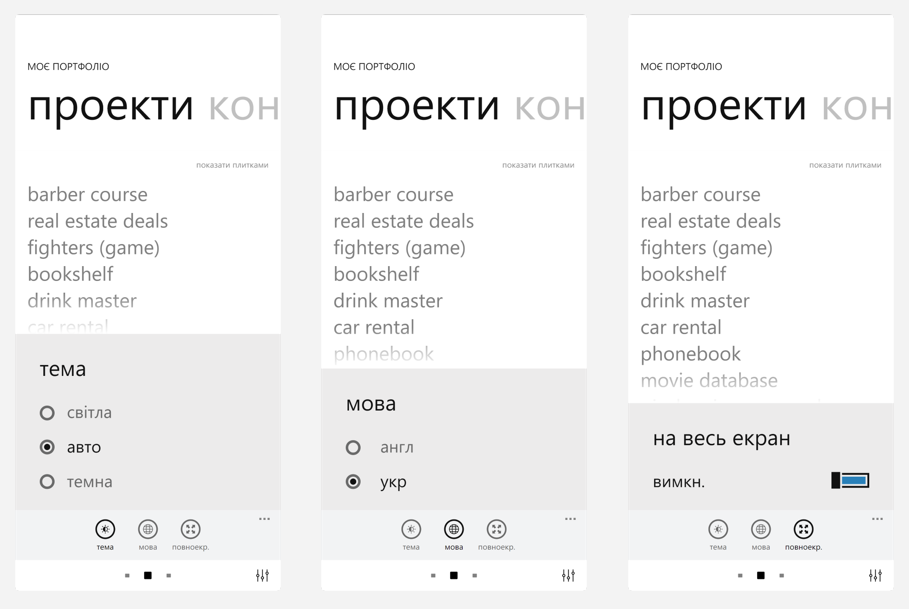

# About Me

To all to whom these presents shall come, greetings :)

This is my personal portfolio website created to showcase my projects and to
give anyone interested a glimpse of my web-development skills.

The website is live on [GitHub Pages](https://dev0652.github.io/about/).

<picture>
  <source media="(max-width: 500px) and (prefers-color-scheme: light)" srcset="./public/images/readme/mobile/scr2_mobile_light.webp">

  <source media="(max-width: 500px) and (prefers-color-scheme: dark)" srcset="./public/images/readme/mobile/scr2_mobile_dark.webp">

  <source media="(prefers-color-scheme: light)" srcset="./public/images/readme/desktop/light_1x.webp 1x, ./public/images/readme/desktop/light_2x.webp 2x">

  <source media="(prefers-color-scheme: dark)" srcset="./public/images/readme/desktop/dark_1x.webp 1x, ./public/images/readme/desktop/dark_2x.webp 2x">

  
</picture>

For the Lumia-like experience, please open it on your phone and enable
full-screen mode in settings (an icon in the bottom right corner).

## Design

The design of this website was inspired by Windows Phone Metro interface which I
have always found clean and attractive.

This is especially noticeable on mobile devices, since the mobile version offers
experience similar to Lumia devices, with navigation between 'screens' done by
swiping and 'sliding headings'. However, additional pagination bullets have been
added in the bottom of the page for the sake of intuitiveness.

Project cards can be viewed either as a list (which is so characteristic of
Metro UI) or a gallery - I couldn't decide which I liked best so I ended up
keeping both.

## Technologies

- vanilla JavaScript
- CSS and SaSS
- Vite
- Sanity
- minimum libraries, just [EmailJS](https://www.emailjs.com/),
  [Swipe.js](https://github.com/lyfeyaj/swipe) and
  [lodash.throttle](https://www.npmjs.com/package/lodash.throttle).

## Features

Here are some of the features of this website:

### Responsive layout

The website is fully responsive, has 4 breakpoints and reacts to orientation
change.

### Color schemes

The website features light and dark color schemes and a three-position theme
switch. By default, the switch is set to 'auto', meaning that the website
follows the system / browser current mode. If a dark or light color scheme is
switched on manually, it will override the system setting.

- the selected color scheme is saved in localStorage and restored on next visit
- the majority of images (including the ones in this readme.md) are also
  available in light and dark versions and respond to the change of a color
  scheme

### Localization / i18n

The website comes in two languages, English and Ukrainian. The selected language
is written to local storage and restored on next visit.

All image `alt`s and `aria-label`s are also localized.

### Keyboard-accessible and screen-reader-friendly

- all controls are focusable and keyboard-accessible
- all images have `alt`s
- interactive elements without text have proper `aria-label`s
- project cards in 'list' presentation have `aria-expanded` attributes

### Mobile-friendly

Not only doest the website have responsive layout, it also allows one-handed
operation in mobile mode, with color scheme and language menus moved to the
bottom pop-up panel, which, too, was inspired by Lumia phones.

Mobile mode also features a full-screen-view toggle for better experience.

<picture>

   <source media="(prefers-color-scheme: light)" srcset="./public/images/readme/mobile-menu/mobile-menu_light_1x.webp 1x, ./public/images/readme/mobile-menu/mobile-menu_light_2x.webp 2x">

   <source media="(prefers-color-scheme: dark)" srcset="./public/images/readme/mobile-menu/mobile-menu_dark_1x.webp 1x, ./public/images/readme/mobile-menu/mobile-menu_dark_2x.webp 2x">

  
</picture>

### Optimization

- images are served in webp format and have been optimized with Squoosh
- all images come with 3 extra de-retinized versions to save bandwidth and
  improve loading times on low-res screens

Lighthouse ratings:

<picture>
  <source media="(prefers-color-scheme: light)" srcset="./public/images/readme/lighthouse/lighthouse_light.webp">

   <source media="(prefers-color-scheme: dark)" srcset="./public/images/readme/lighthouse/lighthouse_dark.webp">

  
</picture>

### Headless CMS

This website uses Sanity as the content management system (CMS). Studio code is
also available on my GitHub [here](https://github.com/dev0652/about-sanity-cms).
